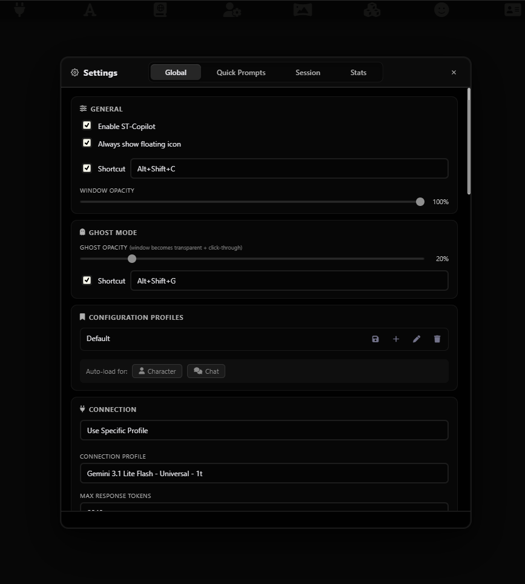
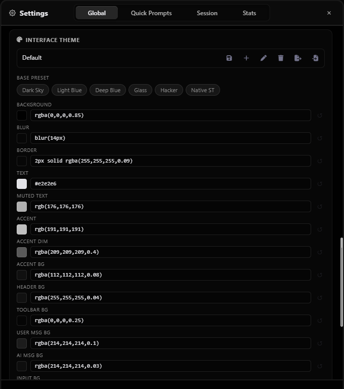

# 🤖 ST-Copilot

Let's be honest: keeping track of complex roleplay lore, remembering NPC motivations, and fighting writer's block can be exhausting. 

Enter **ST-Copilot** — an advanced Out-Of-Character (OOC) meta-assistant, creative co-writer, and Dungeon Master's aide integrated directly into your SillyTavern frontend. It lives entirely outside your narrative, serving as the ultimate brainstorming engine and world-management tool.

---

## What can it do?

| Feature | Description |
| :--- | :--- |
| **🧠 Smart Brainstorming** | Ask for plot twists, scene analysis, or character psychological breakdowns without breaking your RP flow. |
| **🎭 Character Editor** | Create characters from scratch or edit existing cards (description, personality, first messages, etc.) directly in the UI. |
| **📚 AI Lorebook Manager** | Command the AI to draft, edit, or delete Lorebook entries based on the chat. Review changes via a Diff-viewer before applying. |
| **💭 Chat Manager** | Treat your message history like google docs. Ask copilot to edit/hide/add the message. |
| **🎯 Surgical Context** | Hand-pick specific messages from your chat history to feed into the Copilot's context payload. |
| **👻 Ghost Mode** | Make the Copilot window semi-transparent and completely click-through so it never gets in your way. |
| **🎨 Deep Customization** | Built-in theme engine with color pickers, blur effects, and import/export capabilities. |
| **📂 Advanced Sessions** | Keep multiple separate Copilot conversations per chat, including auto-deleting temporary sessions. |

---

## 📸 Visual Tour & Features

Let's take a look under the hood. Here is what ST-Copilot brings to your SillyTavern experience:

### 1. The Command Center

This is your main hub. It functions completely independently of your main chat, packed with tools to control exactly how the AI sees your story.

**Top Bar Controls:**
*   **Search:** Instantly find past brainstorming ideas or lore discussions with `Ctrl+F`.
*   **Ghost Mode:** Toggle window transparency and click-through functionality on the fly so it never blocks your view.
*   **Settings:** Quick access to deep configuration, themes, and API routing.

**Chat & Context Tools:**
*   **Sessions Control:** Seamlessly switch between different brainstorming sessions, rename them, or create auto-deleting temporary ones to keep things organized.
*   **ST Messages Slider (CTX):** Dynamically adjust exactly how many recent messages from your main RP are sent to Copilot's memory.
*   **Lorebooks:** One-click access to the dedicated Lorebook Manager to tweak world info or review AI-proposed changes.
*   **Payload (Message Picker):** Don't want to use the slider? Hand-pick specific messages from your chat history to feed into the Copilot's context payload, ignoring everything else.

**Bottom Action Bar:**
*   **Raw Context:** A transparent inspector that shows you the exact raw text and JSON payload being sent to the API. Perfect for prompt engineers.
*   **Msg Regen:** Quickly force the AI to regenerate its last response if you didn't like the ideas it gave you.
*   **Quick Prompts:** Click the lightning bolt to reveal your custom shortcut buttons (like "Analyze", "Ideas", or "Summary") and speed up your workflow.

> **Wait, does it just write the story for me?**
> Not at all! ST-Copilot is strictly Out-Of-Character (OOC). Its system prompt explicitly forbids it from generating dialogue or actions for you or the main character. It's your sounding board, not your replacement.

### 2. Deep Configuration & Profiles

You have total control over how Copilot behaves. 
*   **Connection Routing:** Don't want to waste expensive API tokens on brainstorming? Route ST-Copilot to a completely different API profile (e.g., a cheaper local model) while your main RP uses your premium API.
*   **Context Inclusions:** Choose exactly what Copilot sees: System Prompts, Author's Notes, Character Cards, or User Personas.
*   **Profiles:** Bind specific Copilot configurations to specific Characters or Chats.

> **What if I only want specific settings for one specific chat?**
> We've got you covered. The **Session Overrides** tab allows you to temporarily alter settings (like context depth or max tokens) just for the active Copilot session without touching your global defaults.

### 3. Worldbuilding on Autopilot (Lorebook Manager)

The crown jewel of ST-Copilot. A dedicated UI for managing your World Info.
*   View all active lorebooks (Global, Character, or Chat-specific).
*   Edit entries, triggers, and content on the fly.
*   **AI-Edits:** Ask Copilot to "Create a lorebook entry about the city we just entered." It will generate a Proposal Card in the chat. You can review the diff, edit the text inline, and apply it directly to your ST Lorebook with one click!

Stop guessing if the AI knows about a lorebook entry.
*   **Visual Indicators:** See exactly which entries were injected into Copilot's last API request (marked with an "in context" badge).
*   **Manual Overrides:** Force an entry to ALWAYS be included in Copilot's context, or NEVER be included, overriding SillyTavern's default keyword triggers.

> **Does Copilot automatically know my lore?**
> Yes! By default, "Auto-keywords" is ON. Copilot will scan your recent chat history and automatically inject relevant lorebook entries into its own memory, just like the main ST chat does.

### 4. Lightning-Fast Quick Prompts

Tired of typing *"Summarize everything that has happened so far"*? 
Create your own **Quick Prompts**. Pick an icon, write the prompt (macros like `{{char}}` and `{{user}}` are supported!), and reorder them to your liking. They will appear as clickable chips right above your chat input.

### 5. Surgical Context Picking

Sometimes a slider isn't enough. If you want Copilot to focus on a specific past event, use the **Pick Context Messages** feature. 
Select exact messages from your RP history. ST-Copilot will completely ignore the rest of the chat and build its context *only* from the messages you checked.

### 6. Usage Statistics

For the data nerds out there. ST-Copilot tracks your usage across all sessions.
*   Track Messages, Regenerations, Active Sessions, and Lorebook Edits.
*   View beautifully rendered, interactive SVG graphs of your Token Input and Output.
*   Filter stats Globally, by Character, or by specific Chat over 30 days, 12 weeks, or even years.

### 7. Transparent Payload Inspector

Ever wonder exactly what is being sent to the API? Click the payload button to see the raw text (Formatted) or JSON structure being sent to the AI. Total transparency for prompt engineers.

### 8. Make It Yours (Theme Engine)

A fully integrated, highly detailed theme editor.
*   Choose from gorgeous presets like *Dark Sky*, *Glass*, *Hacker*, or *Native ST*.
*   Use the integrated interactive color picker (with alpha/transparency support) to tweak every single background, border, and accent color.
*   Export your themes to JSON and share them, or import themes from the community.

---

## Installation

1. Open SillyTavern and navigate to the **Extensions** menu (the plug icon).
2. Click **Install Extension** and paste the link to this repository.
3. Refresh SillyTavern.
4. Click the new **ST-Copilot** button (robot icon) in your extensions menu, or use the default hotkey (`Alt+Shift+C`) to open the interface!

---

## 📜 Changelog History
### V2.8.3
*   **Multi-Query Search:** Enhanced search tools to support multiple queries at once, improving the efficiency of information gathering.
*   **Session & Lorebook Stability:** Fixed critical session deletion bugs and resolved an issue where proposed lorebook changes would persist after being applied.
*   **World Info Drawer:** Patched several bugs in the extension (Special thanks to @Haruny for their time and effort in debugging).
*   **UI/UX Improvements:** Restored missing lorebook source icons and fixed various display/layout issues for a cleaner experience.

### V2.8.2
*   **Character Management:** Expanded AI capabilities to read and modify Character Name, Main Prompt Override, and Post-History Instructions.
*   **Lorebook Tools:** Introduced `get_lorebooks` and enhanced `search_lorebook_entries` with `is_constant` and `is_outlet` parameters.
*   **Autonomous Outlets:** The LLM can now manage Lorebook Outlets (Reset Lorebook Prompt to default to provide necessary context).
*   **Chat & Sessions:** Added chat renaming support and resolved critical session deletion/overwrite bugs.
*   **Maintenance:** Improved token tracking accuracy and optimized internal save logic.

### V2.8.1
*   **World Info Outlets:** Added full support for the `{{outlet::name}}` macro syntax, enabling dynamic content injection directly from World Info entries.
*   **UI/UX Refinement:** Optimized the layout of the settings menu by repositioning tab navigation buttons for a more intuitive user experience.
*   **Bug Fixes:** Resolved several minor stability issues and addressed UI regressions found in the previous version.

### V2.8.0
*   **Tools & Agency:** Copilot is now agentic! It can independently gather and process information to provide more accurate and context-aware responses.
*   **Persistent Memory:** Introduced long-term memory that persists across sessions. You can scope memory to **Global**, **Character-specific**, **Chat-specific**, or **Session-only**.
*   **Smart Anchor Detection:** Implemented a new *Tokenized Sliding Window Levenshtein* algorithm. This ensures "Proposed Changes" are applied accurately even if the LLM makes minor formatting errors.
*   **UI/UX Overhaul:** 
    *   Redesigned **Stats Window** with smoother animations and better optimization.
    *   Refreshed the **Settings UI** within SillyTavern.
    *   Added **Font Size** adjustment and a toggle for **Hidden Messages**.
*   **Context Enhancements:** Added support for including all swipes of the last message in the context.
*   **Extension Support:** Full compatibility for `summaryception` and `aspect:evolutia`.
*   **Optimization & Fixes:** 
    *   Refined all internal prompts to be more token-efficient.
    *   Added **Custom Endpoint** support in connection profiles.
    *   Fixed UI displacement when opening DevTools.
    *   Resolved the bug where system messages disappeared after applying proposed changes.

<b>Previous Updates (v1.7.0 - v2.7.2)</b>

### V2.7.2
*   **Shortcuts Overlay:** Added a dedicated "Shortcuts" configuration window in the settings panel for better accessibility.
*   **Context-Aware Search:** Improved the search shortcut logic; it now triggers exclusively when the Copilot window is focused to prevent global key conflicts.
*   **Character Factory Fixes:** Fixed critical bugs related to character creation and data integrity.
*   **Asset Optimization:** Optimized background storage and handling for faster load times and reduced memory usage.

### V2.7.1
*   **Character Tagging:** Added the ability to modify the "tags" field for already existing characters.
*   **Low Performance Mode:** Introduced a new toggle to optimize resource usage on lower-end hardware.
*   **Session Stability:** Completely overhauled the session saving system to prevent spontaneous session loss and data corruption.
*   **General Optimization:** Improved core logic for better performance and overall stability. Fixed AI Generation errors.

### V2.7.0
*   **Proposed Chat Edits:** A powerful new way to bulk-modify, delete, or hide message ranges. Just ask Copilot to "change the name Elara to Sarah in the last 10 messages" or "hide all mentions of the tavern."
*   **File Attachments & Vision:** Directly upload text files and images to Copilot. Features an internal viewer and supports both direct vision models and the Image Captioning extension.
*   **Message Swiping:** Copilot responses now support regeneration and swipes, allowing you to navigate through different iterations of a reply.
*   **Multimedia Backgrounds:** Customize the Copilot interface with image or video backgrounds (local or URL) including adjustable dimming for better readability.
*   **Character AI Enhancements:** Added support for the **tags** field during character creation and significantly improved generation prompts (credits to @realevernever).
*   **Advanced Overrides & Sync:** Lorebook, Character, and Chat AI settings are now fully synced with Configuration Profiles and accessible via Session Overrides.
*   **UX Improvements:** Added an "Always Off" state for Lorebooks, sender-based group selection in the Context Picker, and focus-aware completion sounds.
*   **Refinements:** Optimized connection profile switching and fixed theme compatibility for list markers and hidden messages.

### V2.5.1
*   **Continue Button:** Added a dedicated button to continue the last Copilot message.
*   **Debug File Support:** You can now save a full debug log from the settings menu to help with troubleshooting. *Note: Export the log before refreshing the page, as it clears on reload.*
*   **Streaming Scroll Fix:** Users can now scroll up to read previous messages without being snapped back to the bottom while the AI is streaming.
*   **Fixes:** Implemented a potential fix for the "profile not found" error.

### V2.5.0
*   **Massive Token Optimization:** Completely overhauled the "Proposed Changes" system. Instead of rewriting entire text blocks, it now uses a smart search-and-replace method, reducing token consumption by over 80%! *(Huge thanks to @Steel-skull on GitHub!)*
*   **Character Card Creator & Editor:** You can now create characters entirely from scratch or edit existing card fields (Description, Personality, Scenario, First Message, Alternate Greetings, and more) directly inside the extension.
*   **Robust Parsing:** Significantly improved parsing logic for "proposed changes" blocks to successfully apply edits even if the AI makes formatting mistakes.
*   **Session Export & Import:** Easily back up, share, or transfer your sessions. Under-the-hood session saving has also been rewritten to be much more efficient.
*   **UI, Sounds & Polish:** Added a generation-complete sound notification, a soothing "wobble" physics effect when dragging windows, smooth interactive chart animations in Stats, and new Streaming modes (Auto, Force On, Force Off).
*   **Lorebook Updates:** Added a "constant" parameter for proposed changes, and reorganized settings by moving the AI Edit and Keytrigger toggles to the main Settings window.
*   **Mobile & Bug Fixes:** The Enter key on mobile keyboards now correctly inserts line breaks instead of sending messages. Fixed mobile UI headers, resolved user message duplication bugs, and redesigned system message outputs.
*   *Note: The default Lorebook AI Edit prompt has been updated. Please reset your prompt to default in the settings to ensure compatibility!*

### V2.3.0
*   **Stream Support:** Added streaming support so you can see generations in real-time.
*   **Reasoning Blocks:** Added native display support for Reasoning blocks.
*   **Regex Support:** Clean up formatting and fluff from chat messages included in the context using regex.
*   **Preset Customization:** Added the ability to modify QuickPrompts and SystemPrompts (SystemPrompts are now handled via session overrides).
*   **Favorite Messages:** You can now mark specific messages as Favorites.
*   **In-App Changelog:** A new window to easily keep track of updates and features directly within the UI.
*   Improved and fixed the default prompt used for Lorebook editing.
*   Fixed a bug where Lorebook entries would incorrectly remain in the context after being disconnected from the chat or character.
*   Fixed message numbering in the Chat Context Picker (now 0 to N) to properly match ST's native numbering.

###  V2.0.0: Massive Update
The **V2.0.0** update is now live. While this update heavily improves how Copilot handles your lore and context, it also brings a massive wave of highly requested QoL improvements.

**Major Features**
- **Messages Payload:** Handpick specific messages from the chat history and feed them directly to the AI.
- **Quick Prompts:** Fully customizable prompt buttons with emoji icons.
- **Ghost Mode:** Copilot can now become semi-transparent and completely click-through.
- **Expanded Context Awareness:** Context now includes the *Character's Note* and *Example of Dialogue*, and respects *Character Settings Overrides*.
- **Temporary Sessions:** Create sessions that automatically delete themselves when you switch.

**UI & Polish**
- **Save Without Generating:** Edit a user message and "Save" without forcing a regeneration.
- **Mobile Improvements:** Responsive window resizing tailored for mobile devices.
- **Usage Stats:** A new interactive Statistics window.
- **HTML & Formatting:** Added HTML support, and introduced clean connecting lines for bulleted lists.
- The Floating Icon dynamically adapts to your UI theme.
- Dismiss System Notifications after handling proposed Lorebook changes.

**Bug Fixes**
- Reworked text formatting (especially nested bulleted lists).
- Fixed a logic bug where dismissed Lorebook proposals would incorrectly append to the end of the chat.
- Fixed dialog windows disappearing if the mouse was released outside the window.
- Fixed the floating icon randomly disappearing on mobile.

### V1.9.0
*   **Integrated Settings Window:** Dedicated settings UI for seamless adjustments.
*   **Session-Specific Configuration:** Override global settings for individual sessions.
*   **Dynamic Context Scaling:** The CTX slider dynamically adjusts its range based on chat length.
*   **Advanced In-Chat Search:** Quickly locate specific information (`Ctrl + F`).
*   **Theme Portability:** Import and Export custom themes as JSON.
*   **New Theme:** Added the "Dark Sky" preset.

### V1.7.2
*   **Comfortable Color Picker:** Choose colors natively without leaving the app.
*   **Default Colors:** Individually reset specific colors to the original theme defaults.
*   **Resizable edit window:** You can now manually resize the "content" window in the Lorebook Manager.
*   Fixed mobile lorebook manager scaling.

### V1.7.1
*   **Expandable Entry Descriptions:** Click to expand chat entry descriptions.
*   **Data Protection:** Unsaved changes warnings when switching profiles.
*   **Lorebook Dropdowns:** Individual Lorebook selection dropdowns for each entry proposal.
*   **New Macro:** Added `{{active_lorebooks}}` support.
*   Context tracks when you accept/reject entries.

### V1.7.0
*   **The AI Lorebook Management (AI-Edit):** Copilot AI now actively assists in world-building.
*   **Interactive Proposals:** AI generates Proposal Cards to review, edit, or reject changes via a Diff View modal.
*   **Lorebook Manager UI:** Manual overrides, Auto-Keywords, and Active Indicators.
*   **String Trimming:** Automatically remove specific tags (like `<think>` blocks) from AI responses.
*   **Persistent Icon:** Keep the floating dock icon visible at all times.

---
*Built with ❤️ for the SillyTavern community by Quren.*